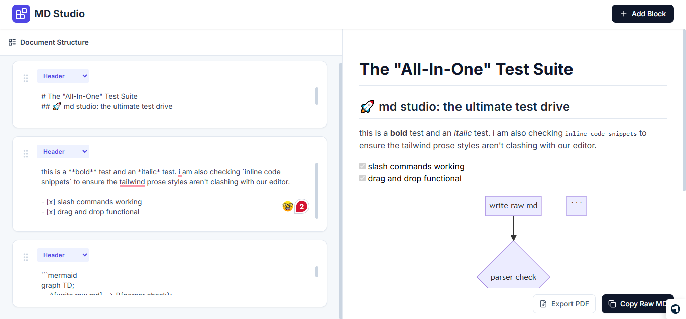

# md studio

i wanted a better way to write docs without fighting markdown syntax.

### the problem

here is the exact loop i found myself stuck in every time i finished a project:

```text
build cool project 
      ↓
write all the code 
      ↓
time for the readme 
      ↓
forget the exact syntax for a markdown table or mermaid flowchart
      ↓
write a messy, text-only readme 
      ↓
repo looks unpolished
```

i saw people using heavy desktop apps like notion just to export a simple markdown file, or constantly switching tabs to look up syntax cheat sheets. 

that was the unlock for me. 
so i built this tool to make writing markdown visual, drag-and-droppable, and zero-friction, right in the browser. no backend required.<br>


### what it does

md studio turns your messy thoughts into structured, pro-grade markdown.
* gives you a notion-style slash command interface (`/`) to build complex things instantly.
* lets you drag and drop document blocks to reorder them without copy-pasting.
* renders real-time visual previews side-by-side (including svgs for diagrams).
* auto-saves everything locally so you never lose a draft.
* exports perfectly cropped pdfs without css layout bugs.

### features

**the block builder**
* left-side drag and drop interface
* individual text areas that auto-resize as you type
* hover toolbars for quick inline formatting (code pills, bold, italic)

**the slash command magic (`/`)**
* type `/diagram` to drop a mermaid flowchart template (renders live)
* type `/math` for latex equations (rendered via katex)
* type `/badges` to open a modal that generates github shield badges (mit license, npm, build passing)
* type `/table` to instantly drop a formatted markdown table

**the "silver bullet" pdf export**
* uses html2pdf, but intercepts the clone mid-flight to strip out tailwind's `overflow-hidden` constraints.
* result: captures the whole document perfectly without cropping or zooming bugs.

### tradeoffs

* this is a client-side only tool right now. it doesn't sync across your devices because there is no database. it lives in your browser's local storage.
* the visual preview is optimized for github-flavored markdown. if you try to inject crazy custom html components, the visualizer might not render them exactly how your specific website would.

### setup (local)

you barely need anything to run this. no api keys, no paid models, no `.env` files.

**1) clone it**
```bash
git clone https://github.com/zumermalik/md-generator.git
cd md-generator
```

**2) run it**
```bash
npx serve public
```

**3) use it**
open `http://localhost:3000` in your browser.

### how to use it well

* start with a simple `/h1` block for your title.
* use the `/badges` command in the very next block to make it look official.
* brain dump your thoughts into different blocks, then use the grip icon to drag and reorder the narrative.
* if you need to explain architecture, type `/diagram`, edit the mermaid text, and watch it draw the svg on the right.
* hit export pdf if you need to send a clean spec doc to a client.

### roadmap

what i want to add next:
- [ ] dark mode toggle (essential)
- [ ] cloud syncing (maybe wired up to supabase down the line)
- [ ] export to raw html
- [ ] custom css themes for the pdf export (so it doesn't just look like github)
- [ ] code syntax highlighting themes in the preview
